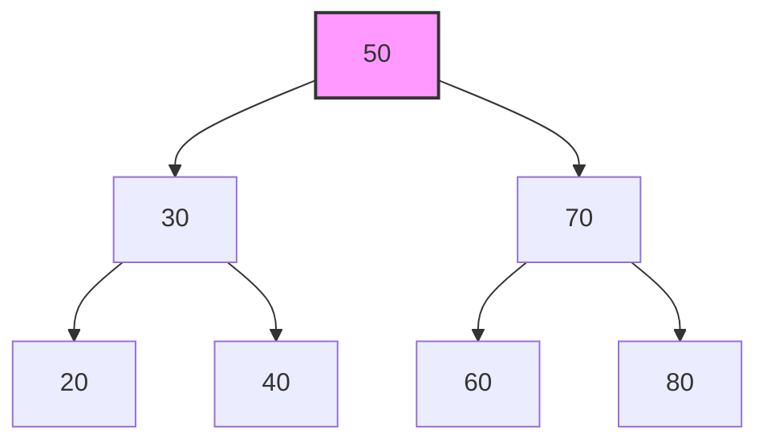

# 📊 Estruturas de Dados: Organizando a Informação

**Estruturas de Dados** são formas específicas de organizar, armazenar e gerenciar dados em um computador para que possam ser utilizados de maneira eficiente. Elas não são uma linguagem de programação ou um framework, mas sim um conceito fundamental da Ciência da Computação que pode ser implementado em qualquer linguagem.

Pense em uma biblioteca. Os livros (os dados) podem ser organizados de várias maneiras: jogados em uma pilha aleatória, alinhados em prateleiras por ordem alfabética, ou catalogados por um sistema de fichas. Cada método é uma "estrutura" diferente. Achar um livro em uma pilha aleatória é muito lento. Achar em prateleiras ordenadas é rápido. A escolha da estrutura de dados correta é crucial para criar programas rápidos e eficientes.

### Por Que Elas São Importantes? (Eficiência)

Não existe uma "melhor" estrutura de dados; cada uma tem seus próprios **prós e contras**. A escolha depende do problema que você está tentando resolver. A eficiência de uma estrutura de dados é geralmente medida pelo quão rápido ela consegue realizar operações como:

  - **Acesso**: Ler o dado em uma determinada posição.
  - **Busca**: Encontrar um determinado dado.
  - **Inserção**: Adicionar um novo dado.
  - **Deleção**: Remover um dado.

A eficiência dessas operações é comumente descrita usando a **Notação Big O**, que mede como o tempo de execução ou o uso de memória cresce à medida que a quantidade de dados aumenta.

-----

## 🧱 Estruturas de Dados Fundamentais

As estruturas de dados são geralmente divididas em dois tipos: lineares e não-lineares.

### Estruturas Lineares

Os dados são organizados em uma sequência.

#### Array (Vetor)

Uma coleção de elementos de tamanho fixo, armazenados em blocos de memória contíguos. Cada elemento é acessado por um índice numérico.

  - **Prós**: Acesso extremamente rápido a qualquer elemento pelo seu índice (O(1)).
  - **Contras**: Inserir ou deletar um elemento no meio é lento (O(n)), pois todos os elementos subsequentes precisam ser deslocados. O tamanho geralmente é fixo.
  - **Uso Comum**: Armazenar coleções de dados cujo tamanho é conhecido e onde o acesso rápido por índice é a prioridade.

#### Lista Ligada (Linked List)

Uma sequência de elementos (nós), onde cada nó armazena seu próprio dado e um ponteiro para o próximo nó na sequência.

  - **Prós**: Inserção e deleção rápidas no início, meio ou fim (O(1)), desde que se tenha a referência ao nó. Tamanho dinâmico.
  - **Contras**: Acesso e busca de um elemento são lentos (O(n)), pois é preciso percorrer a lista desde o início.
  - **Uso Comum**: Implementar outras estruturas de dados como pilhas e filas; situações que exigem muitas inserções/deleções.

#### Pilha (Stack)

Uma estrutura que segue o princípio **LIFO (Last-In, First-Out)**: o último elemento a entrar é o primeiro a sair. Pense em uma pilha de pratos.

  - **Operações**: `push` (adicionar no topo), `pop` (remover do topo).
  - **Prós**: Todas as operações são muito rápidas (O(1)).
  - **Contras**: Acesso limitado apenas ao elemento do topo.
  - **Uso Comum**: Gerenciamento de chamadas de funções em programação, funcionalidade de "desfazer" (undo) em editores.

#### Fila (Queue)

Uma estrutura que segue o princípio **FIFO (First-In, First-Out)**: o primeiro elemento a entrar é o primeiro a sair. Pense em uma fila de supermercado.

  - **Operações**: `enqueue` (adicionar no fim), `dequeue` (remover do início).
  - **Prós**: Todas as operações são muito rápidas (O(1)).
  - **Contras**: Acesso limitado apenas aos elementos do início e do fim.
  - **Uso Comum**: Gerenciamento de tarefas em segundo plano (background jobs), filas de impressão, gerenciamento de requisições em um servidor.

### Estruturas Não-Lineares / Associativas

#### Tabela Hash (Hash Table / Dicionário)

Armazena dados em pares de **chave-valor**. Ela usa uma função hash para converter a chave em um índice de um array, permitindo acesso muito rápido aos valores.

  - **Prós**: Inserção, busca e deleção extremamente rápidas em média (O(1)).
  - **Contras**: No pior caso (colisões de hash), as operações podem se degradar para (O(n)). A ordem dos elementos não é garantida.
  - **Uso Comum**: Caching de dados, implementação de objetos em JavaScript, bancos de dados, busca de dados por um identificador único.

#### Árvore (Tree)

Uma estrutura de dados hierárquica que consiste em nós conectados por arestas. Possui um nó raiz, e cada nó pode ter nós filhos.

  - **Árvore de Busca Binária (Binary Search Tree)**: um tipo especial onde o nó esquerdo de um pai é sempre menor e o nó direito é sempre maior.
  - **Prós**: Busca, inserção e deleção muito eficientes (O(log n)) se a árvore estiver balanceada. Representa naturalmente dados hierárquicos.
  - **Contras**: Pode se tornar desbalanceada, degradando a performance para (O(n)).
  - **Uso Comum**: Sistemas de arquivos, representação do DOM em HTML, indexação de bancos de dados, preenchimento automático (autocomplete).

#### Grafo (Graph)

Uma coleção de nós (vértices) e conexões (arestas) entre eles. É a estrutura mais flexível, podendo representar qualquer tipo de relação.

  - **Prós**: Modela redes e relacionamentos complexos do mundo real.
  - **Contras**: Algoritmos de travessia e busca podem ser complexos.
  - **Uso Comum**: Redes sociais (amigos são nós conectados), sistemas de mapeamento como Google Maps (cidades são nós, estradas são arestas), a própria internet.

-----

## 📈 Comparando a Eficiência (Big O Notation)

A tabela abaixo resume a complexidade de tempo média das operações mais comuns para cada estrutura.

| Estrutura de Dados     | Acesso (por índice/chave) | Busca      | Inserção   | Deleção    |
| ---------------------- | ------------------------- | ---------- | ---------- | ---------- |
| **Array** | `O(1)`                    | `O(n)`     | `O(n)`     | `O(n)`     |
| **Lista Ligada** | `O(n)`                    | `O(n)`     | `O(1)`     | `O(1)`     |
| **Pilha** | `O(n)`                    | `O(n)`     | `O(1)`     | `O(1)`     |
| **Fila** | `O(n)`                    | `O(n)`     | `O(1)`     | `O(1)`     |
| **Tabela Hash** | `O(1)`                    | `O(1)`     | `O(1)`     | `O(1)`     |
| **Árvore Busca Binária** | `O(log n)`                | `O(log n)` | `O(log n)` | `O(log n)` |

**Visualização de uma Árvore de Busca Binária:**

Neste exemplo, para encontrar o número `60`, você não precisa checar todos os 7 nós. Você vai para `50` (raiz), depois para a direita (`70`, pois 60 \> 50), e depois para a esquerda (`60`, pois 60 \< 70). Isso é muito mais rápido do que uma busca linear.

-----

## ✅ Como Escolher a Estrutura Certa?

Faça a si mesmo estas perguntas sobre o seu problema:

  - **Eu preciso acessar elementos por um índice numérico de forma super rápida e o tamanho da coleção não muda muito?**
      - Use um **Array**.
  - **Eu preciso inserir e remover elementos no meio da coleção com muita frequência?**
      - Use uma **Lista Ligada**.
  - **Eu preciso de acesso quase instantâneo aos dados com base em um identificador único (como um nome de usuário ou ID do produto)?**
      - Use uma **Tabela Hash**.
  - **Eu preciso processar os dados na ordem exata em que chegaram?**
      - Use uma **Fila**.
  - **Eu preciso acessar e remover o item adicionado mais recentemente?**
      - Use uma **Pilha**.
  - **Meus dados são hierárquicos ou precisam ser mantidos em ordem para buscas rápidas?**
      - Use uma **Árvore**.
  - **Eu preciso modelar uma rede complexa de conexões, como uma rede de amigos ou um mapa de cidades?**
      - Use um **Grafo**.